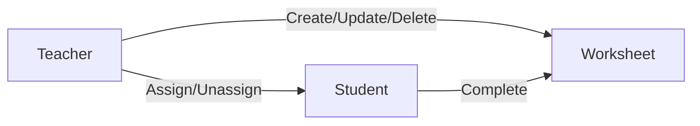

# Introduction
Welcome to our LMS—a digital classroom where teachers create and assign worksheets, and students complete them with ease.

# Getting Started
Our LMS is split into two projects: api (backend) and portal (frontend). Check each project's documentation for local setup instructions.

# Diagram
